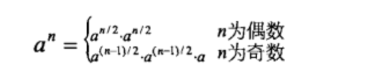

# 11-数值的整数次方

## 题目

牛客OJ：[11-数值的整数次方](https://www.nowcoder.com/practice/1a834e5e3e1a4b7ba251417554e07c00?tpId=13&tqId=11165&tPage=1&rp=1&ru=%2Fta%2Fcoding-interviews&qru=%2Fta%2Fcoding-interviews%2Fquestion-ranking)

《剑指offer》：`P90`

## 边界问题

在解题之前，要先考虑边界问题。我的处理为：

- 如果底数为**0**，则返回**0**。
- 如果底数为**1**，则返回**1**。
- 如果指数为**0**，则返回**1**。

## 最简单的方法

最简单的方法就是循环n（n等于参数exponent）次乘法。

```c++
class Solution {
public:
    double Power(double base, int exponent) {
        if (base == 0.0) {
            return 0.0;
        }

        if (base == 1.0 || exponent == 0) {
            return 1.0;
        }

        bool isNegative = false; // 指数是否为负数
        if (exponent < 0) {
            isNegative = true;
            exponent = -exponent;
        }

        double result = 1.0;
        for (int i = 0; i < exponent; ++i) {
            result *= base;
        }

        // 如果指数为负数，则结果去倒数
        if (isNegative) {
            result = 1 / result;
        }

        return result;
    }
};
```

## 高效的方法



根据这个公式，可以将时间复杂度降到**O(logn)**。

### 除法

#### 循环

```c++
class Solution {
public:
    double Power(double base, int exponent) {
        if (base == 0.0) {
            return 0.0;
        }

        if (base == 1.0 || exponent == 0) {
            return 1.0;
        }

        bool isNegative = false; // 指数是否为负数
        if (exponent < 0) {
            isNegative = true;
            exponent = -exponent;
        }

        double result = 1.0;
        double temp = base;
        while (exponent != 0) {
            // 指数为奇数
            if (exponent % 2) {
                result *= base;
            }
            temp *= temp;
            exponent *= 2;
        }

        // 如果指数为负数，则结果去倒数
        if (isNegative) {
            result = 1 / result;
        }

        return result;
    }
};
```

#### 递归

```c++
class Solution {
public:
    double Power(double base, int exponent) {
        if (base == 0.0) {
            return 0.0;
        }

        if (base == 1.0 || exponent == 0) {
            return 1.0;
        }

        bool isNegative = false; // 指数是否为负数
        if (exponent < 0) {
            isNegative = true;
            exponent = -exponent;
        } 

        double result = powerNormal(base, exponent);

        // 如果指数为负数，则结果去倒数
        if (isNegative) {
            result = 1 / result;
        }

        return result;
    }

private:
    double powerNormal(double base, int exponent) {
        if (exponent == 0) {
            return 1;
        }
        if (exponent == 1) {
            return base;
        }

        double result = powerNormal(base, exponent / 2);
        result *= result;
        // 指数为奇数
        if (exponent % 2) {
            result *= base;
        }

        return result;
    }
};
```

### 位运算

观察前面的方法，发现指数每次都是减小一半，即除以2，这个可以用位运算实现。

#### 循环

```c++
class Solution {
public:
    double Power(double base, int exponent) {
        if (base == 0.0) {
            return 0.0;
        }

        if (base == 1.0 || exponent == 0) {
            return 1.0;
        }

        bool isNegative = false;
        if (exponent < 0) {
            isNegative = true;
            exponent = -exponent;
        } 

        double result = 1.0;
        double temp = base;
        while (exponent != 0) {
            // 指数为奇数
            if ((exponent & 1) == 1) {
                result *= base;
            }
            temp *= temp;
            exponent >>= 1;
        }

        // 如果指数为负数，则结果去倒数
        if (isNegative) {
            result = 1 / result;
        }

        return result;
    }
};
```

#### 递归

```c++
class Solution {
public:
    double Power(double base, int exponent) {
        if (base == 0.0) {
            return 0.0;
        }

        if (base == 1.0 || exponent == 0) {
            return 1.0;
        }

        bool isNegative = false; // 指数是否为负数
        if (exponent < 0) {
            isNegative = true;
            exponent = -exponent;
        } 

        double result = powerNormal(base, exponent);

        // 如果指数为负数，则结果去倒数
        if (isNegative) {
            result = 1 / result;
        }

        return result;
    }

private:
    double powerNormal(double base, int exponent) {
        if (exponent == 0) {
            return 1;
        }
        if (exponent == 1) {
            return base;
        }
        
        double result = powerNormal(base, exponent >> 1);
        result *= result;
        // 指数为奇数
        if ((exponent & 1) == 1) {
            result *= base;
        }
        return result;
    }
};
```

