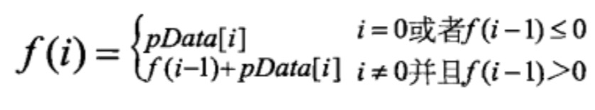

# 31-连续子数组的最大和

## 题目

牛客OJ：[31-连续子数组的最大和](https://www.nowcoder.com/practice/459bd355da1549fa8a49e350bf3df484?tpId=13&tqId=11183&rp=1&ru=/ta/coding-interviews&qru=/ta/coding-interviews/question-ranking)


《剑指offer》：`P171`

## 暴力破解

枚举出所有子数组并求出它们的和，从中找出最大值。

暴力破解方法的时间复杂度为**O(n^2)**。

```c++
class Solution {
public:
    int FindGreatestSumOfSubArray(vector<int> array) {
        if (array.empty()) {
            return 0;
        }
        
        int max = array[0]; // 最大和

        int arrayLen = array.size();
        for (int i = 0; i < arrayLen; ++i) {
            int sum = 0;
            for (int j = i; j < arrayLen; ++j) {
                sum += array[j];

                if (sum > max) {
                    max = sum;
                }
            }
        }

        return max;
    }
};
```

## 分治

最大子序列和可能出现在三个地方：出现在数据的左半部分，出现在数据的右半部分，或者包含中间，同时涉及到左右两部分，则：

1. 找出左半部分的最大子段和。
2. 找出有半部分的最大子段和。
3. 包含中间，同时涉及到左右两部分的最大子段和。
4. 比较以上三个值，找出最大子段和。

分治方法的时间复杂度为**O(nlogn)**。

```c++
class Solution {
public:
    int FindGreatestSumOfSubArray(vector<int> array) {
        if (array.empty()) {
            return 0;
        }

        return maxSum(array, 0 ,array.size() - 1);
    }

private:
    int maxSum(vector<int> &array, int left, int right) {
        if (left == right) {
            return array[left];
        }

        int center = (left + right) / 2;
        int maxLeftSum = maxSum(array, left, center); // 计算左半部分最大子段和
        int maxRightSum = maxSum(array, center + 1, right); // 计算右半部分最大子段和

        /**
         * 计算包含中间，同时涉及到左右两部分的最大子段和
         */
        int maxLeftBorderSum = array[center], leftBorderSum = 0;
        for (int i = center; i >= left; --i) {
            leftBorderSum += array[i];
            if (leftBorderSum > maxLeftBorderSum) {
                maxLeftBorderSum = leftBorderSum;
            }
        }

        int maxRightBorderSum = array[center + 1], rightBorderSum = 0;
        for (int j = center + 1; j <= right; ++j) {
            rightBorderSum += array[j];
            if (rightBorderSum > maxRightBorderSum) {
                maxRightBorderSum = rightBorderSum;
            }
        }

        return max(maxLeftSum, maxRightSum, maxLeftBorderSum + maxRightBorderSum);
    }

    int max(int n, int m, int l) {
        int max;
        max = n > m ? n : m;
        if (l > max) {
            max = l;
        }

        return max;
    }
};
```

## 动态规划

如果用函数f(i)表示以第i个数字结尾的子数组的最大和，那么我们需要求出max(f[0...n])。我们可以给出如下递归公式求f(i)：



这个公式的意义：

1. 当以第(i-1)个数字为结尾的子数组中所有数字的和f(i-1)小于0时，如果把这个负数和第i个数相加，得到的结果反而不第i个数本身还要小，所以这种情况下最大子数组和是第i个数本身。
2. 如果以第(i-1)个数字为结尾的子数组中所有数字的和f(i-1)大于0，与第i个数累加就得到了以第i个数结尾的子数组中所有数字的和。

```c++
// 动态规划 实现一
class Solution {
public:
    int FindGreatestSumOfSubArray(vector<int> array) {
        if (array.empty()) {
            return 0;
        }

        int max = array[0]; // 最大和

        int arrayLen = array.size();
        for (int i = 0, j; i < arrayLen; i = j + 1) {
            int sum = 0;
            for (j = i; j < arrayLen; ++j) {
                sum += array[j];

                if (sum > max) {
                    max = sum;
                }

                // sum是负数的话，就不需要累加，子段从头开始
                if (sum < 0) {
                    break;
                }
            }
        }

        return max;
    }
};
```

```c++
// 动态规划 实现二
class Solution {
public:
    int FindGreatestSumOfSubArray(vector<int> array) {
        if (array.empty()) {
            return 0;
        }
        
        int max = array[0]; // 最大和
        int sum = 0;

        int arrayLen = array.size();
        for (int i = 0; i < arrayLen; ++i) {
            sum += array[i];
            if (sum > max) {
                max = sum;
            }

            // sum是负数的话，就不需要累加，子段从头开始
            if (sum < 0) {
                sum = 0;
            }
        }

        return max;
    }
};
```

实现一和实现二是一样的，区别只是实现二将内循环展开了而已。

动态规划方法的时间复杂度为**O(n)**。